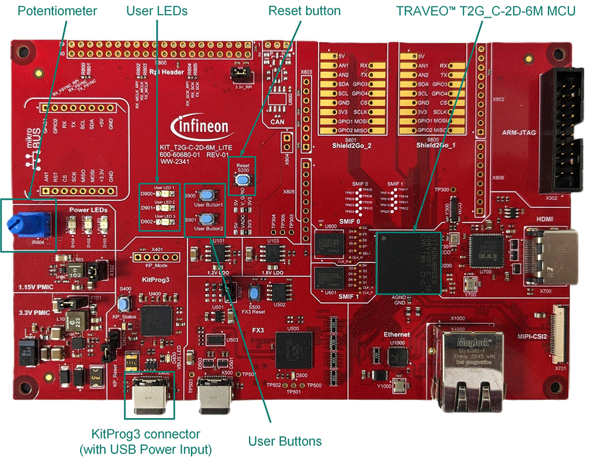
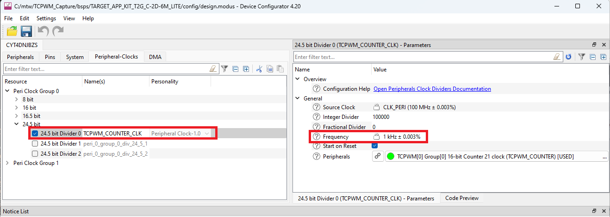

# TCPWM Capture
**This code example shows how to configure the capture function using TCPWM (Timer, Counter and Pulse Width Modulator) block and describes its operation and initial settings.**

## Device
The device used in this code example (CE) is:
- [TRAVEO™ T2G CYT4DN Series](https://www.infineon.com/cms/en/product/microcontroller/32-bit-traveo-t2g-arm-cortex-microcontroller/32-bit-traveo-t2g-arm-cortex-for-cluster/traveo-t2g-cyt4dn/)

## Board
The board used for testing is:
- TRAVEO&trade; T2G Cluster 6M Lite Kit ([KIT_T2G_C-2D-6M_LITE](https://www.infineon.com/cms/en/product/evaluation-boards/kit_t2g_c-2d-6m_lite/))

## Scope of work
The example configures TCPWM (Timer, Counter and Pulse Width Modulator) as the Counter mode with User Button2 (USER_BTN2) as input. The button is used as start, reload and stop trigger. In addition, the rising edge made by the button release will be captured by the counter.

## Introduction  

TCPWM block in TRAVEO&trade; T2G implements a 16 or 32-bit timer, counter, pulse width modulator (PWM), pseudo random PWM, shift register, and quadrature decoder functionality.

The TCPWM block has the following features:

- Supports up to four counter groups (device specific)
- Each counter group consists up to 256 counters (counter group specific)
- Each counter can run in one of seven function modes
- Timer-counter with compare
    - Timer-counter with capture
    - Quadrature decoding
    - Pulse width modulation/stepper motor control (SMC) for pointer instruments
    - PWM with dead time/three-phase motor control (Brushless-DC, BLDC)
    - Pseudo-random PWM
    - Shift register mode
- 16-bit or 32-bit counters (counter group specific)
- Up, down, and up/down counting modes
- Clock prescaling (division by 1, 2, 4, ... 64, 128)
- Up to two capture and compare functions (counter group specific)
- Double buffering of all compare/capture and period registers
- Two output trigger signals for each counter to indicate underflow, overflow, and capture/compare events; they can also  directly be connected with the line output signal
- Supports interrupt on:
    - Terminal Count - Depends on the mode; typically occurs on overflow or underflow
    - Capture/Compare - The count is captured in the capture registers or the counter value equals the value in the compare register

- Integrate board-level Boolean logic functionality into a port
- Ability to pre-process high-speed I/O matrix (HSIOM) input signals from the General Purpose I/O (GPIO) port pins
- Support in all device power modes
- Integrate closely to the I/O pads, providing shortest signal paths with programmability

More details can be found in:
- TRAVEO&trade; T2G CYT4DN
  - [Technical Reference Manual (TRM)](https://www.infineon.com/dgdl/?fileId=8ac78c8c8691902101869f03007d2d87)
  - [Registers TRM](https://www.infineon.com/dgdl/?fileId=8ac78c8c8691902101869ef098052d79)
  - [Data Sheet](https://www.infineon.com/dgdl/?fileId=8ac78c8c869190210186f0cceff43fd0)

## Hardware setup
This CE has been developed for:
- TRAVEO&trade; T2G Cluster 6M Lite Kit ([KIT_T2G_C-2D-6M_LITE](https://www.infineon.com/cms/en/product/evaluation-boards/kit_t2g_c-2d-6m_lite/)) 

**Figure 1. KIT_T2G_C-2D-6M_LITE (Top View)**

 
  
   - **GPIO pins list**
     <table border="1" style="border-collapse: collapse">
     <thead><tr>
     <th>Board</th><th>USER_BTN</th><th>TCPWM input pin</th><th>Note</th></tr></thead>
     <tbody>
     <tr><td><code>KIT_T2G_C-2D-6M_LITE</code></td><td>User Button2 (P0[3])</td><td>P0[3]</td><td>None</td></tr>
     </tbody>
     <tbody>
     </table>  

## Implementation

The firmware is implemented in *main.c* and performs the following functions:

1. In this code example, TCPWM counter is configured as down counting timer with the clock 1 kHz. 
2. The counter will be triggered by falling edge of the User Button2 and the initial counter value 99999 will be reloaded at the same time. 
3. The timer captures the counter value at rising edge of the button with compare/capture 0 (CC0) Interrupt. 
4. If the User Button2 is not released 10 seconds, a terminal count (TC) interrupt will occur.
5. Both the interrupts will show the status information on the terminal.

**ModusToolbox&trade; Device configurator**

This code example project can be created or imported using ModusToolbox&trade; IDE. To configure the project in the **Quick Panel**, click on **Device Configurator**    

**Figure 2. Select Device Configurator**
  

**Figure 3. Configuration TCPWM**
  

**Figure 4. Configuration User Button2**
  

**Figure 5. Configuration Clock**
  

The basic idea is that the TCPWM will capture and store the counter values to the registers when the User Button2 is released.

- <a href="https://infineon.github.io/mtb-pdl-cat1/pdl_api_reference_manual/html/group__group__tcpwm__functions__counter.html#ga6068a06ddc8a07c67bb6df86e920944c"><i>Cy_TCPWM_Counter_Init()</i></a> reflects the TCPWM configuration to the device
- The configurations regarding the USER_BTN2 and the clock used by TCPWM are reflected in *cybsp_init()* automatically
- The interrupt handler *handle_TCPWM_IRQ()* is registered by <a href="https://infineon.github.io/mtb-pdl-cat1/pdl_api_reference_manual/html/group__group__sysint__functions.html#gab2ff6820a898e9af3f780000054eea5d"><i>Cy_SysInt_Init()</i></a>, and calling *NVIC_SetPriority()* and *NVIC_EnableIRQ()* to enable the interrupt
- Then <a href="https://infineon.github.io/mtb-pdl-cat1/pdl_api_reference_manual/html/group__group__tcpwm__functions__counter.html#ga1707e2cc291fe486fbea346157c65bff"><i>Cy_TCPWM_Counter_Enable()</i></a> enables the configured TCPWM functionality

This code example asks user to press and release the User button2 to start the counter and to capture the time interval. The function *handle_TCPWM_IRQ()* handles two types of interrupt. After the TCPWM channel starts counting by a falling edge of USER_BTN2 (means User Button2 push), the function will be called when a rising edge (means User Button2 release) has been detected. Or also when an underflow (means 10 seconds passed without User Button2 release) has been detected.
- Firstly, this function calls <a href="https://infineon.github.io/mtb-pdl-cat1/pdl_api_reference_manual/html/group__group__tcpwm__functions__common.html#gabb00d4f53ff5db82aa6f5e5ae0e79f8a"><i>Cy_TCPWM_GetInterruptStatusMasked()</i></a> to get interrupt reason, then calls <a href="https://infineon.github.io/mtb-pdl-cat1/pdl_api_reference_manual/html/group__group__tcpwm__functions__common.html#ga0c7a2d667dc983c82327463529f5d283"><i>Cy_TCPWM_ClearInterrupt()</i></a> to clear it
- If the interrupt reason is *CY_TCPWM_INT_ON_CC0*, it means rising edge was detected, so the function calls <a href="https://infineon.github.io/mtb-pdl-cat1/pdl_api_reference_manual/html/group__group__tcpwm__functions__counter.html#ga53321a824ba298d75d8bed089bfb4595"><i>Cy_TCPWM_Counter_GetCapture0Val()</i></a> to get captured counter value
- Otherwise if the interrupt reason is *CY_TCPWM_INT_ON_TC*, it means underflow was detected

**Miscellaneous settings**  

- STDIN / STDOUT setting

  - Calling <a href="https://infineon.github.io/retarget-io/html/group__group__board__libs.html#ga21265301bf6e9239845227c2aead9293"><i>cy_retarget_io_init()</i></a> function to use UART as STDIN / STDOUT
    - Initialize the port defined as *CYBSP_DEBUG_UART_TX* as UART TX, defined as *CYBSP_DEBUG_UART_RX* as UART RX (these pins are connected to KitProg3 COM port)
    - The serial port parameters become to 8N1 and 115200 baud

## Compiling and programming
Before testing this code example:  
- Power the board through the dedicated power connector 
- Connect the board to the PC through the USB interface
- Build the project using the dedicated Build button  or by right-clicking the project name and selecting "Build Project"
- To program the board, in the **Quick Panel**, scroll down, and click **[Project Name] Program (KitProg3_MiniProg4)**

## Run and Test
For this example, an oscilloscope is needed to monitor User Button2 port pin to check the correctness of the time interval captured by the software. In this example, Picoscope3000 series is used with SW [Pico scope 7](https://www.picotech.com/downloads) to monitor user button signal.

- Open the terminal program (example download and install [Tera Term](https://teratermproject.github.io/index-en.html) select the KitProg3 COM port. Set the serial port parameters to 8N1 and 115200 baud.

- After programming, the code example starts automatically and asks for User Button2 press and releases.

**Figure: Terminal startup**

   

- Press and release the User button2.
- Monitor the time interval of User button2 press/release using oscilloscope and Terminal.

**Figure: Terminal and Scope Output**

  

  

- You can debug the example to step through the code. In the IDE, use the **[Project Name] Debug (KitProg3_MiniProg4)** configuration in the **Quick Panel**. For details, see the "Program and debug" section in the [Eclipse IDE for ModusToolbox™ software user guide](https://www.infineon.com/dgdl/?fileId=8ac78c8c8929aa4d0189bd07dd6113f9).

**Note:** **(Only while debugging)** On the CM7 CPU, some code in *main()* may execute before the debugger halts at the beginning of *main()*. This means that some code executes twice: once before the debugger stops execution, and again after the debugger resets the program counter to the beginning of *main()*. See [KBA231071](https://community.cypress.com/docs/DOC-21143) to learn about this and for the workaround.

## References  
Relevant Application notes are:
- [AN235305](https://www.infineon.com/dgdl/?fileId=8ac78c8c8b6555fe018c1fddd8a72801) - Getting started with TRAVEO&trade; T2G family MCUs in ModusToolbox&trade;
- [AN220224](https://www.infineon.com/dgdl/?fileId=8ac78c8c7cdc391c017d0d3a800a6752) - How to Use Timer, Counter, and PWM (TCPWM) in Traveo II Family

ModusToolbox&trade; is available online:
- <https://www.infineon.com/modustoolbox>

Associated TRAVEO&trade; T2G MCUs can be found on:
- <https://www.infineon.com/cms/en/product/microcontroller/32-bit-traveo-t2g-arm-cortex-microcontroller/>

More code examples can be found on the GIT repository:
- [TRAVEO™ T2G Code examples](https://github.com/orgs/Infineon/repositories?q=mtb-t2g-&type=all&language=&sort=)

For additional trainings, visit our webpage:  
- [TRAVEO™ T2G trainings](https://www.infineon.com/cms/en/product/microcontroller/32-bit-traveo-t2g-arm-cortex-microcontroller/32-bit-traveo-t2g-arm-cortex-for-cluster/traveo-t2g-cyt4dn/#!trainings)

For questions and support, use the TRAVEO&trade; T2G Forum:  
- <https://community.infineon.com/t5/TRAVEO-T2G/bd-p/TraveoII>
